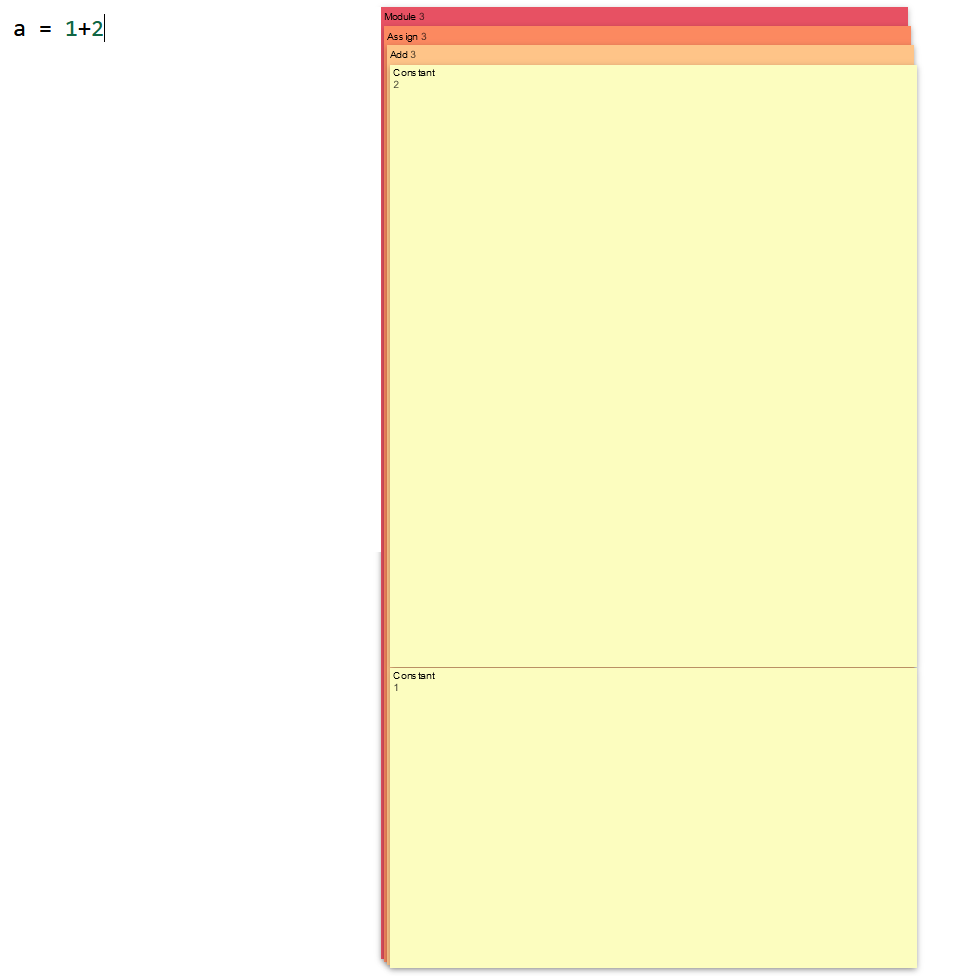

# Python AST Visualizer

## What
- [CodeMirror](https://codemirror.net/) to create a fancy textbox
- [PyScript](https://pyscript.net/) to execute that editor for the python to... actually work
  - *This should just be [pyscript-editor](https://docs.pyscript.net/2024.6.1/user-guide/editor/), but remade so I can hook into keydown events.*
- PyScript to run [ast.parse](https://docs.python.org/3/library/ast.html) on the code.
- Walk the tree to convert it to a python dictionary, add the values we want, pass it back to javascript.
- [d3](https://d3js.org/) to render [some graph](https://observablehq.com/@d3/cascaded-treemap?intent=fork).

## Next For Working
I don't want to re-invent the wheel getting pyscript and codemirror to play nice. PyScript already did that. I'd rather put their editor in, and hook into the keydown events.

So far, It's vanilla javascript, so i have some pains with imports and such. If I switch to node (or fork the whole project), bleh, then I can get a reference to the editor view (or just copy the [editor plugin](https://github.com/pyscript/pyscript/blob/main/pyscript.core/src/plugins/py-editor.js) wholesale...) and add my keydown events.

